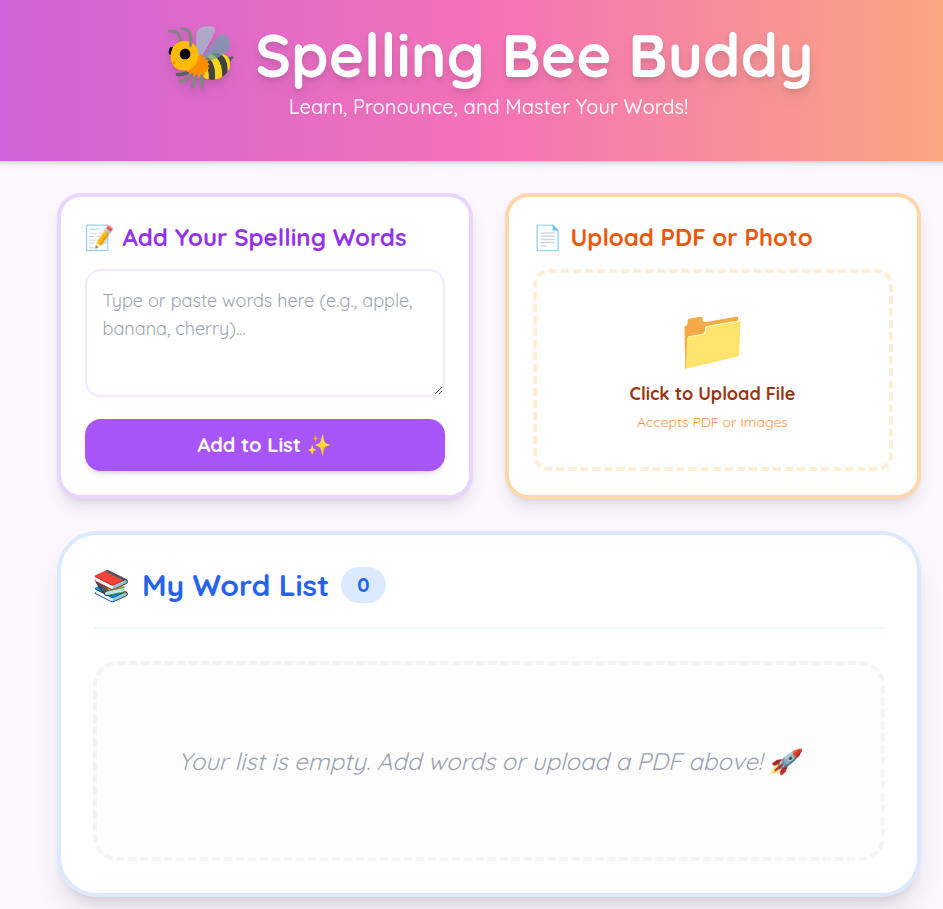

# 🐝 Spelling Bee Buddy

[](https://lemoncap523.github.io/spelling-bee-helper/)



Welcome to **Spelling Bee Buddy**, the ultimate interactive preparation tool designed specifically for young champions! This app helps students master their spelling words through AI-powered definitions, multi-language support, and high-quality audio pronunciations.

## 🌟 What is Spelling Bee Buddy?

Learning a long list of spelling words can be tough! **Spelling Bee Buddy** makes it fun and easy by providing instant context for every word. It's not just about memorizing letters; it's about understanding what words mean and how to use them in real life.

### Key Features:
- **⚡ Lightning Fast AI**: Uses Gemini 3 Flash to get definitions and examples in a heartbeat.
- **📚 Smart Caching**: Once a word is searched, it’s saved on your device forever (or until you clear it), so it loads instantly next time!
- **📸 Magic File Reader**: Upload a photo of your homework or a PDF word list, and the AI will automatically find and add the words for you.
- **🔊 Hear it Clearly**: High-quality text-to-speech helps you hear the exact pronunciation.
- **🌏 Multi-language**: Every word comes with a simple English definition and a Traditional Chinese (繁體中文) explanation.

---

## 🚀 How to Use

### 1. Add Your Words
There are two ways to build your list:
- **Type them in**: Use the "Add Your Spelling Words" box. You can type words separated by commas, spaces, or new lines.
- **Upload a List**: Click the orange "Upload PDF or Photo" box. You can take a picture of your physical spelling list or upload a school PDF. Our AI will extract the words for you!

### 2. Explore and Learn
- Click on any word in your **My Word List**.
- A magic window will pop up showing:
    - **How it sounds**: Click the pink speaker icon 🔊 to hear it.
    - **What it means**: Read a kid-friendly English definition.
    - **Chinese Translation**: See the Traditional Chinese meaning.
    - **Real-life Example**: See how the word is used in a fun sentence!

### 3. Manage Your List
- **Remove one word**: Hover over a word and click the small "X" to delete it.
- **Clean Slate**: Click the big red **"Clear Everything"** button to delete all words and saved definitions when you're ready for a new week of spelling!

---

---

## � Development Setup

### Project Initialization
1.  **Clone the repository**:
    ```bash
    git clone <repository-url>
    cd spelling-bee-buddy
    ```
2.  **Install dependencies**:
    ```bash
    npm install
    ```
3.  **Environment Configuration**:
    -   Create a `.env` file in the root directory.
    -   Add your Gemini API key (ensure you have access to Gemini 1.5 Flash or similar models):
        ```env
        GEMINI_API_KEY=your_actual_api_key_here
        ```

### Available Scripts
-   `npm run dev`: Starts the local development server at `http://localhost:3000`.
-   `npm run build`: Compiles the application for production deployment to `dist/`.
-   `npm run preview`: Previews the production build locally.
-   `npm run lint`: Checks the code for quality issues using ESLint.
-   `npm run format`: Formats the codebase using Prettier.

### ✅ Manual Verification Checklist
Once the server is running, perform these actions to verify the app is fully functional.

**Test 1: Single Word Search**
1.  In the "Add Your Spelling Words" text box, type a simple word like `apple`.
2.  Press **Enter** or click "Add".
3.  **Verify**: The word `apple` appears in "My Word List". Click it to ensure definitions, translations, and examples load.

**Test 2: Audio Pronunciation**
1.  In the detail modal, click the **Speaker Icon** (🔊).
2.  **Verify**: You hear a clear voice pronunciation. (*Ensure volume is on.*)

**Test 3: Magic File Reader (PDF)**
1.  Click the **"Upload PDF or Photo"** area.
2.  Select the included `full-list.pdf` file from the project root.
3.  **Verify**: The app processes the file, and a list of words (extracted from the PDF) appears in your list.

**Test 4: Persistence**
1.  Refresh the browser page.
2.  **Verify**: Your word list is safe and still there.

**Troubleshooting**
-   **"Something went wrong! Check your internet!"**: Check your `.env` file (see Environment Configuration above).
-   **Audio not playing**: Check browser permissions or try interacting with the page first.

### 🚀 CI/CD Pipeline
This project is configured with a **GitHub Actions** workflow (`.github/workflows/deploy.yml`) for direct automated deployment.
-   **Trigger**: Pushes to the `main` branch.
-   **Process**: Installs dependencies, runs code linting, builds the project, and uploads artifacts directly.
-   **Target**: **GitHub Pages** (via GitHub Actions).

### 🛡️ Git Configuration
A comprehensive `.gitignore` file is configured to follow industry best practices:
-   **Dependencies**: `node_modules` are excluded.
-   **Build Artifacts**: `dist/` and temporary build files are ignored.
-   **Security**: `.env` and other sensitive configuration files are strictly excluded to prevent API key leakage.

---

## 🛠️ Technical Architecture

-   **Frontend**: React 19 with Tailwind CSS for a bouncy, responsive UI.
-   **Build Tool**: Vite 6.
-   **AI Engine**: 
    -   `gemini-3-flash-preview` for word definitions and document extraction.
    -   `gemini-2.5-flash-native-audio-preview-09-2025` for high-quality TTS.
-   **State Management**: Uses `useReducer` for atomic, bug-free state transitions.
-   **Persistence**: All data is synced to `localStorage`, acting as a local cache to minimize API usage and maximize speed.

Built with ❤️ to help the next generation of spelling champions! 🏆